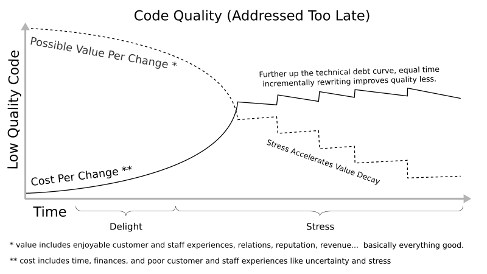
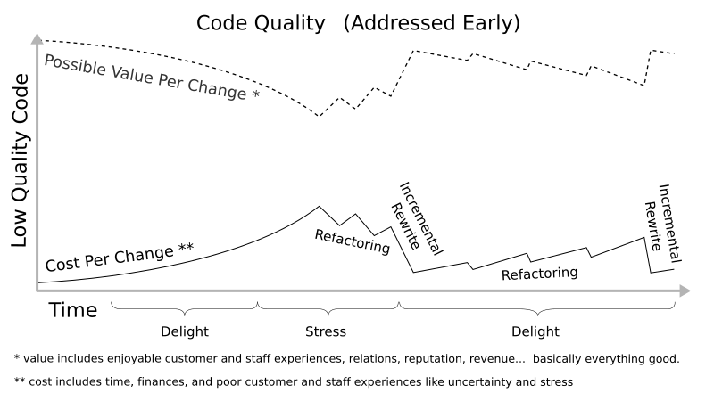
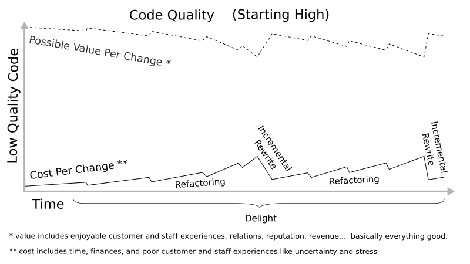

Startup SaaS Company.  Two years in.  Funds running low.  Our JavaScript is a ball of mud.  One page costs $94k per year to maintain.  140 pages.  Shit.  How did we get here?

## Backstory
A couple of great guys learned javascript (Angular 1) to launch a SaaS business.  They had neither coding experience nor formal programming education.  Still, they were smart and focused and used Angular to produce features at an incredible rate.

Code quality was low.  It wasn't a problem.  The code was short.  Changes to one "page" (angular template + controller + route) took ~20 minutes.  They added customers.  They added developers.

When I started 1.5 years in, our most troublesome page's code was 2500 lines.  New technical leadership prioritized a back-end rewrite first.  Bugs abounded in that page and others.  I stabilized what I could.  Months of whack-a-mole bug squashing while the back-end code changed.  Mud can only get so clean.  Global variables littered the code.  Unexpected things often broke.  Customers complained.  Tests were flaky or non-existent.  Error prevention processes expanded from quick functionality checks, to multi-person code reviews, multi-person manual tests, extensive change communication, whole-team pre-release testing sessions, and dedicated QA staffing.

Estimated time per change grew to around 3 hours.  I got curious.  Most changes went to fixing and re-fixing bugs that crept in from introducing new features or fixing other bugs.  Git showed 500 changes to that page in the last year.  1500 hours spent maintaining one page.  We had 140 other pages with similar issues.  Not good.

## Costs 
Financially speaking, assume $80k per year per developer, add $50k for benefits, overhead, taxes, etc.  Total $130k/yr.  There are about 2080 hours per work year in the US, so each hour costs roughly $62.5 USD.  Multiply 1500 hours by $62.5/hr, and that page required $94,000 per year to maintain.

[Outcomes](https://hbr.org/2012/11/its-not-just-semantics-managing-outcomes) extended further.  Good experiences produce delight and pleasant interactions among users, staff, their teams, and beyond.  Bad experiences create stress and sour interactions.  Unexpected behaviors produce confusion, frustration, and stress.  Delays also produce frustration.  Low reliability adds to stress through uncertainty and perceived lack of control, while decreasing sales staff confidence and company reputation.  Ripple effects spread the impacts into other areas of life, like the impact of carrying increased stress home.

1500 hours, $94k, bad experiences.  Low-quality JavaScript exacts many costs from you, your team, your company, your users, and many people each of you interact with.

## Causes 
Developer Fault?  No.  All devs I've met generally do the best they can given their experience.  When you start to learn JavaScript, and your programming background is:
  - Classical Object-oriented, you follow OO examples and use OO libraries because they make sense to you. You work around JavaScript's OO quirks.
  - Functional, you follow functional examples and use functional libraries because they make sense to you.  You work around JavaScript's functional quirks.
  - None, no articles make sense yet.  You follow guidelines from all articles because they're written by more experienced developers.  You don't know that programming languages have quirks.

The path to getting stuff done looks something like this:
 - Article 1: (jQuery) Submit your form with `$('.loginForm').submit()`;
 - Article 2: (jQuery) Separate concerns is good - separate your data and functions from others' data and functions by namespacing them in an object.
 - Article 3: (OO) Separate concerns is good - do it with modules, classes, and objects with data and functions
 - Article 4: (functional) Separate concerns is good - do it with modules, classes, and objects with data, and functions

A few days later Frankenstein's monster emerges into the web.

What happened?  Well, to start, modules, objects, and separate concerns probably meant different things in each of them.

Problems arise when new devs learn programming through variably-accurate articles and instruction created by variably-experienced developers, using ambiguous, often-misunderstood labels from often-misunderstood, often-unstated philosophies to describe often-misunderstood, sometimes-conflicting "good" coding principles.  Then they attempt to write high-quality code in a new language with its own label interpretations and philosophy implementations, often using frameworks with additional ambiguous labels and interpretations (e.g., Angular 1's expressions & services).

### The Problem
Ambiguity, misunderstandings, complexity, and information overload make it nearly impossible for new developers to create solid conceptual links between daily code decisions and value.  A simple heuristic develops - "whatever code works".  Its result, low quality code [accumulates imperceptibly](https://en.wikipedia.org/wiki/Boiling_frog#As_metaphor) with every change, increasing costs and decreasing the code's ability to produce value.   For companies with SaaS/PaaS business models, frequent changes quickly grow human and financial costs.  As average cost per change approaches average value per change, net-positive changes grow increasingly scarce.  Once the threshold is crossed, re-achieving net-positive-outcome changes is nearly impossible.

### Solution: High Quality Code
This article's purpose is to help you, as a new JavaScript developer, produce significantly higher-quality code, in less time, with greater effectiveness and greater understanding, for the sake of you, your team, your organization, your customers, and everyone else involved.

Let's start by removing uncertainty.  Here are the basic connections between "Whatever Works" code and Value.  
**Code > ~uncertainty~ > Quality > Value**

Here are the connections with uncertainty replaced:  
**Code > Practices + Principles + Philosophies  > Quality  > Value**

In future articles we'll explore Code, Practices, Principles, and Philosophies.  In this article, we'll dive into quality and value.

**Terms to Know:**
 - **Value**: people's desires satisfied  
 - **Quality**: code's ability to satisfy people's desires
 - **[Technical Debt](https://en.wikipedia.org/wiki/Technical_debt)**: accumulations of low-quality code

#### Quality
Quality is like Ice Cream.  It comes in flavors.  Different flavors exist because people and organizations have different desires.

You might have heard terms like "flexibility", "reliability", and "usability" before.  Those are quality flavors.  Quality flavors are called system quality attributes.

There are [many](https://www.infoq.com/articles/atam-quality-attributes) [software](https://msdn.microsoft.com/en-us/library/ee658094.aspx) [system](https://ewh.ieee.org/r2/southern_nj/BarbacciOct03.pdf) [quality](http://citeseerx.ist.psu.edu/viewdoc/download?doi=10.1.1.101.5016&rep=rep1&type=pdf) [attributes](https://en.wikipedia.org/wiki/List_of_system_quality_attributes).  Choosing those that best meet organizational desires can seem overwhelming.  A good place to start is focusing on 1-3 attributes whose definitions seem most critical to your organization.  For example, we desire our planes stay airborne, so reliability is an important quality attribute in airplane software.  Businesses often desire quick adaptation to market conditions, so changeability is a important quality attribute in many businesses.  Most developers work for businesses, so this series will focus on changeability.

**Changeability**: How fast you or other devs can make error-free code changes to satisfy people's desires

Things to be aware of:
  - Quality attributes often have overlapping definitions (e.g., changeability, [modifiability](https://www.infoq.com/articles/atam-quality-attributes), and [maintainability](https://en.wikipedia.org/wiki/Maintainability#Software_engineering) all include some aspect of quickly making changes)
  - Different articles use different words for the same or similar quality attributes. (e.g., changeability, modifiability, maintainability again)
  - Choose your attributes carefully.  If we write highly flexible code for airplanes, and highly reliable code for businesses, we'll spend months or years producing high cost, needlessly redundant business software plus dangerous airline software.
  - You'll chase your tail if you try to satisfy all attributes.  There are tradeoffs.  For example, optimizing an algorithm for "efficiency" often decreases "understandability", which increases time to learn+change it, which decreases changeability
  - When writing code, it's easy to lose perspective amidst the complexity and start optimizing for low priority attributes like execution/memory efficiency.  Posting your attributes in a visual reminder can help retain perspective

#### Quality: The Right Amount at the Right Time 

Writing an app using "what works" quality is equivalent to swimming blindfolded above a large waterfall.  Swimming upstream improves quality, only you're unsure which direction that is exactly.

Far from the waterfall's edge swimming upstream is easy.  The current is calm.  Little quality bumps work well.  Close to the edge the current accelerates.  Swimming upstream requires more energy.  Bigger quality bumps are necessary. 

Like the accelerating current, accumulating low quality code increases costs and decreases value at an exponential rate due to connections with other code parts (a.k.a. couples, a term we'll revisit later).  For example, making a change to a global "user" variable that spans 100 views, with 10 places in each view that reference the object or values derived from it, means one change, in one file, to the user object can break 1000 other places in the code.  If any of those rely on that value to make further changes, there are then 1000 * 1000 places that can indirectly break.  Checking a million possible logic paths through the code, across asynchronous route transitions, is impractical and error prone.

Preventing such problems by writing high quality code early is wise.  Realistically, not all of us have that option, so let's explore solution size and related terms at different distances from the waterfall edge (how close potential value per change is to cost per change). 

**Terms to Know**
 * **feature freeze**: adding no code for new features - prevents further quality decay
 * **refactor**: replace small code parts (small quality improvements)
 * **partial/incremental rewrite**: replace large code parts
 * **full rewrite**: replace all code

##### Over the Edge - Fall  
Once cost exceeds value, you're over the edge.  Bugs abound.  Reputation suffers due to both bugs and delays.  Last month's high value features are not high enough now.  There are no more solutions whose value outweighs their cost.  Escaping now is as easy as swimming up a waterfall.  Fortunately the effects are usually less permanent.  Accept it.  Deal with the consequences.  Move on.  Learn.  

#####  Near the Edge - Swim Hard 
You're close to the edge.  There's little you can do.  Swimming only slows your downstream progress.  You need to dig deep.  Some level of rewrite is necessary.  Getting upstream is going to be painful and exhausting.  The time, energy, and finances required are large.  Think year-ish large.  Bugs and necessary feature freezes turn everyone's delight to stress, especially for leadership and sales.  Adding new code to satisfy customer promises is swimming downstream into the accelerating current.  It adds more bugs that will likely affect other customers, and wastes time because it will likely get thrown away or rewritten due to its low-quality dependencies.  

#####  Decently Far - Swim 
You're far enough away from the edge that swimming upstream still works well.  You have options.  Less dramatic, more incremental solutions like refactoring, partial feature freezes, and partial rewrites still reduce costs.  You can even swim downstream a little when customers have a deadline.    

#####  Standing near the Shore - Walk 
Refreshing cool water around your ankles.  Walking forward to swim is tempting.  That noise is probably just the wind in the trees.  Probably.  Then again, why accept the uncertainty?  You could just remove the blindfold, notice the waterfall, walk up the trail, and swim in a quiet pool a mile upstream.  Learning to write higher-quality code from the start keeps your costs low, your value high, your chances of success high, and greatly improves everyone's experience in the process.  

#### Quality: Determining the Right Time
Judging your proximity to the waterfall's edge is difficult.  The water feels still because you're moving with it.  The noise is consistently loud.  It's unclear if swimming upstream actually works.

Each quality attribute will have its own metrics.  Changeability metrics likely include some combination of [user experience](https://www.google.com/search?q=user+experience+metrics), [net promoter score](https://en.wikipedia.org/wiki/Net_Promoter), and [code](https://en.wikipedia.org/wiki/Halstead_complexity_measures) [complexity](https://en.wikipedia.org/wiki/Cyclomatic_complexity) to assess potential value/cost change over time. Further metrics exploration is outside this article’s scope. Comments about them are welcome since they’re important to make informed decisions.

## Summary 
Problem: **Code > ~uncertainty~ > Quality > Value**  
Uncertainty between daily code decisions and value result in a "Whatever Works" heuristic that exponentially decreases potential software value with each change.

Solution: **Code > Practices + Principles + Philosophies  > Quality > Value**

Terms to Know:
 - **Value**: People's desires Satisfied
 - **Quality**: Code's ability to satisfy peoples' desires
 - **Quality Attributes**: Express the "flavor" of quality. Derived from organization priorities.
 - **Changeability**: How fast you or other devs can make error-free code changes to satisfy people's desires
 - **[Technical Debt](https://en.wikipedia.org/wiki/Technical_debt)**: accumulations of low-quality code

As low quality code accumulates, cost per change increases exponentially, and potential value per change decreases exponentially.  Judging where you are on the curve is difficult, so improving quality early is important.

How to Increase Quality?  By increasing Changeability!  
How to Increase Changeability?  By reading upcoming articles in this series!  

Rough Series Roadmap:
 - Code: The basics, for context and examples in the following posts. (introduces language structures, purposes, patterns, cohesion)
 - Philosophies, Principles, and Practices: High level introduction to OO/Functional/Procedural Philosophies, Principles overview, Composition/Inheritance
 - Principles Part 1: Zero Repetition
 - Principles Part 2: Zero Couples
