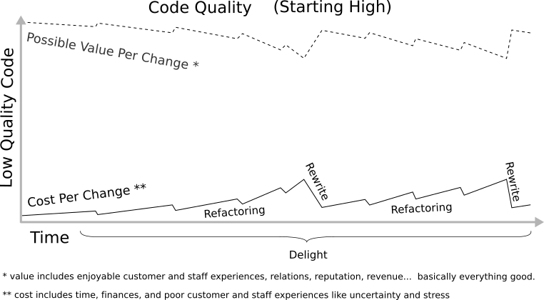

Startup SaaS Company.  Two years in.  Funds running low.  Our JavaScript is a ball of mud.  One page costs $94k per year to maintain.  140 pages.  Shit.  How did we get here?

## Backstory
A couple of great guys learned javascript (Angular 1) to launch a SaaS business.  They had neither coding experience nor formal programming education.  Still, they were smart and focused and used Angular to produce features at an incredible rate.

Code quality was low.  It wasn't a problem.  The code was short.  Changes to one "page" (angular template + controller + route) took ~20 minutes.  They added customers.  They added developers.

When I started 1.5 years in, our most troublesome page's code was 2500 lines of code.  New technical leadership prioritized a back-end rewrite first.  Bugs abounded in that page and others.  I stabilized what I could.  Months of whack-a-mole bug squashing while the back-end code changed.  Mud can only get so clean.  Global variables littered the code.  Unexpected things often broke.  Customers complained.  Tests were flaky or non-existent.  Error prevention processes expanded from a quick functionality checks, to multi-person code reviews, multi-person manual tests, extensive change communication, whole-team pre-release testing sessions, and dedicated QA staffing.

Estimated time per change grew to around 3 hours.  I got curious.  Most changes went to fixing and re-fixing bugs that crept in from introducing new features or fixing other bugs.  Git showed 500 changes to that page in the last year.  1500 hours spent maintaining one page.  We had 140 other pages with similar issues.  Not good.

## Costs
Financially speaking, assume 80k per year per developer, add 50k for benefits, overhead, taxes, etc.  Total 130k/yr.  There are about 2080 hours per work year in the US, so each hour costs roughly $62.5 USD.  Multiply 1500 hours by $62.5/hr, and that page required $94,000 per year to maintain.

[Outcomes](https://hbr.org/2012/11/its-not-just-semantics-managing-outcomes) extended further.  Good experiences produce delight and pleasant interactions among users, staff, their teams, and beyond.  Bad experiences create stress and sour interactions.  Unexpected behaviors produce confusion, frustration, and stress.  Delays produce frustration.  Low reliability adds to stress through uncertainty and perceived lack of control, while decreasing sales staff confidence and company reputation.  Ripple effects spread the impacts into other areas of life, like the impact of carrying increased stress home.

1500 hours, $94k, bad experiences.  Low-qualitiy JavaScript exacts many costs from you, your team, your company, your users, and many people each of you interact with.

## Causes?
Developer Fault?  No.  All devs I've met generally do the best they can given their experience.

When you start to learn JavaScript, and your programming background is:
  - Classical Object-oriented, you follow OO examples and use OO libraries because they make sense to you. You work around JavaScript's OO quirks.
  - Functional, you follow functional examples and use functional libraries because they make sense to you.  You work around JavaScript's functional quirks.
  - None, no articles make sense yet.  You follow guidelines from all articles because they're written by more experienced developers.  You don't know that programming languages have quirks.

The path to getting stuff done looks something like this:

 - Article 1: (jQuery) Submit your form with `$('.loginForm').submit()`;
 - Article 2: (jQuery) Separate concerns is good - separate your data and functions from others' data and functions by namespacing them in an object.
 - Article 3: (OO) Separate concerns is good - do it with modules, classes, and objects with data and functions
 - Article 4: (functional) Separate concerns is good - do it with modules, classes, and objects with data, and functions

A few days later Frankenstein's monster emerges into the web.

What happened?  Well, to start, modules, objects, and separate concerns probably meant different things in each of them.

Problems arise when new devs learn programming through variably-accurate articles and instruction created by variably-experienced developers, using ambiguous, often-misunderstood labels from often-misunderstood, often-unstated philosophies to describe often-misunderstood, sometimes-conflicting "good" coding principles.  Then they attempt to write high-quality code in a new language with its own label interpretations and philosophy implementations, often using frameworks with additional ambiguous labels and interpretations (e.g., Angular 1's expressions & services).

### The Problem
Ambiguity, misunderstandings, complexity, and information overload make it nearly impossible for new developers to create solid conceptual links between daily code decisions and value.  A simple heuristic develops - "whatever code works".  Its result, low quality code [accumulates imperceptibly](https://en.wikipedia.org/wiki/Boiling_frog#As_metaphor) with every change, increasing costs and decreasing the code's ability to produce value.   For companies with SaaS/PaaS business models, frequent changes quickly grow human and financial costs.  As average cost per change approaches average value per change, net-positive changes grow increasingly scarce.  Once the threshold is crossed, re-achieving net-positive-outcome changes is nearly impossible.

Writing an app using "what works" quality is equivalent to swimming blindfolded above a large waterfall.  The closer you get to the edge, the faster the current gets.  The water feels still because you're moving with it.  The noise is consistently loud.  It's unclear if swimming upstream actually works.

Judging your proximity to the edge is difficult.  The more pressure there is to produce value, the higher the likelihood you're near or over the edge.  Not the best indicator, I know.  Value per change is difficult to measure.  Comments regarding metrics are very welcome.

### Solution
This article's purpose is to help you, as a new JavaScript developer, produce significantly higher-quality code, in less time, with greater effectiveness and greater understanding, for the sake of you, your team, your organization, your customers, and everyone else involved.

Let's start by removing uncertainty (i.e., the blindflold).  Here are the basic connections between "Whatever Works" code and Value.

**Code > ~uncertainty~ > Quality > Value**

Here are the connections with uncertainty replaced:

**Code > Practices + Principles + Philosophies  > Quality  > Value**

#### What exactly is Value?
**Value** is people's desires satisfied.

#### What exactly is Quality?
**Quality** is code's ability to satisfy people's desires. Quality's nature varies for each piece of software because people's desires for that software vary.  Quality's different natures are called system quality attributes.  You might have heard terms like "flexibility", "reliability", and "usability" before.  These are system quality attributes.  There are [many](https://www.infoq.com/articles/atam-quality-attributes) [software](https://msdn.microsoft.com/en-us/library/ee658094.aspx) [system](https://ewh.ieee.org/r2/southern_nj/BarbacciOct03.pdf) [quality](http://citeseerx.ist.psu.edu/viewdoc/download?doi=10.1.1.101.5016&rep=rep1&type=pdf) [attributes](https://en.wikipedia.org/wiki/List_of_system_quality_attributes).

Saying code is flexible, or changeable, or reliable should say something about how an organization produces value.  For example, we desire our planes stay airborn, so reliability is an important quality attribute in airplane software.  To stay competitive, businesses often desire to change quickly, so changeability is a important quality attribute in many businesses.

A good place to start is focusing on 1-3 attributes whose definitions seem most critical to your organization.  This series of articles will focus on changeability.  **Changeability**: How fast you or others can make error-free code changes to produce the desired behaviors.  Most of us work for businesses.  Most businesses with programmers want to adapt to changing conditions. Focusing on changeability often results in other attributes like modularity, flexibility, testability, and reliability.

Things to be aware of:
  - Quality attributes often have overlapping definitions
  - Different articles use different words for the same or similar quality attributes
  - Know what aspects of quality you're trying to achieve when reading dev articles.  They'll help you understand what's important.
  - You'll chase your tail if you try to satisfy all attributes.  There are tradeoffs.  For example, optimizing an algorithm for "efficiency" often decreases "understandability"
  - Choose your attributes carefully.  If we write highly flexible code for airplanes, and highly reliable code for businesses, we'll spend months or years producing high cost, needlessly redundant business software plus dangerous airline software.
  - Coding is mentally absorbing. Losing perspective in the weeds is easy.  A common case for devs is optimizing for efficiency (aka execution speed) when such gains are super low priority.  Revisit Attributes frequently to retain perspective.
  - Term to Know: Accumulations of low-quality code are an aspect of **[Technical Debt](https://en.wikipedia.org/wiki/Technical_debt)**

#### Quality: The Right Amount at the Right Time
If you've made it this far, there's a decent chance you're you're already in the river.  Let's explore what quality improvement solutions look like at different distances from the edge (how close potential value per change is to cost per change).

##### Solution Terms to Know
Solutions vary from adding no code, to replacing all code.  Each has has a different name and and different cost, depending on how time/energy/financially exhausting it is:
| metaphor | Action | Term |
| ------------- | ------------- | ------------- |
| treading water  | not adding code  | feature freeze  |
| small strokes  | replace small code parts  | refactoring  |
| medium strokes  | replace large code parts  | partial/incremental rewrite  |
| large strokes  | replace all code  | rearchitecture/rewrite  |

Far from the waterfall edge, swimming upriver is easy.  Most any stroke is effective.  At the edge, no stroke is powerful enough.
Let's consider those solutions in terms of proximity to waterfall edge (how close value per change is to cost per change).  Starting at the edge and working backward.
Solutions At Distances

##### Over the Edge
Once cost exceeds value, you're over the edge.  Bugs abound.  Reputation suffers due to both bugs and delays.  Last month's high-value features are not high enough now.  Escaping is as easy and probable as escaping as an actual waterfall plummet.  Fortunately the effects are usually less permanent.  Accept it.  Deal with the consequences.  Move on.  Learn.

#####  Near the Edge - Get Help
You're close to the edge.  Your best upstream strokes can almost stop your your downstream slippage, but not quite.  The only way out is external help.  Maybe yell for a rope, an immediate and large investment of engineering time, energy, and finances, or perhaps [a rudimentary lathe](https://www.youtube.com/watch?v=EQG3I5efwWo).

No image for this one.  Finding and catching a rope is highly improbable.  If a rope does appear, it came from the river's side.  You can't pull yourself out instantly.  You're still going over, just maybe not all the way down if you can hold on.  Getting out is going to hurt.  Necessary feature freezes will increase stress for everyone, especially leadership and sales.  Adding low-quality code to satisfy customer promises is like swimming downstream into the accelerating current.  It only makes sense if the rope clearly landed there.  Adding high-quality code now is clinging to a floating log.  It's going over too, will get trashed in the fall, and won't help you climb the rope.

#####  Decently Far - Swim
You're far enough away from the edge that swimming upstream still works well.  Value per change well above cost per change gives you options.  You can even swim downstream a little when customers have a deadline.  Less dramatic, more incremental solutions like refactoring, partial feature freezes, and partial rewrites still reduce costs.

#####  Prevent the Problem - Go Somewhere Wiser
Refreshing cool water around your ankles.  Walking forward to swim is tempting.  That noise is probably just the wind in the trees.  Probably.  Then again, why accept the uncertainty?  You could just remove the blindfold, notice the waterfall, walk up the trail, and swim in a quiet pool a mile upstream.  Learning to write higher-quality code from the start keeps your costs low, your value high, your chances of success high, and greatly improves everyone's experience in the proccess.

## Summary

Problem: Devs have difficulty connecting code to value
Solution: **Code > Practices + Principles + Philosophies  > Quality > Value**

Value: People's desires Satisfied
Quality: Code's ability to satisfy peoples' desires.  Expressed as System Quality Attributes (e.g. Changeability)

How to Increase Quality?  To be Continued in upcoming articles!

Rough Article Roadmap:
Code: The basics, for context and examples in the following posts. (introduces language structures, purposes, patterns, cohesion)
Philosophies, Principles, and Practices: High level introduction to OO/Functional/Procedural Philosophies, Principles overview, Composition/Inheritance
Principles Part 1: Zero Repetition
Principles Part 2: Zero Couples
