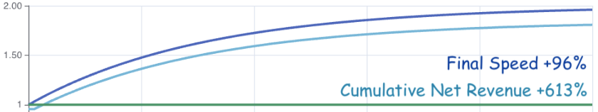
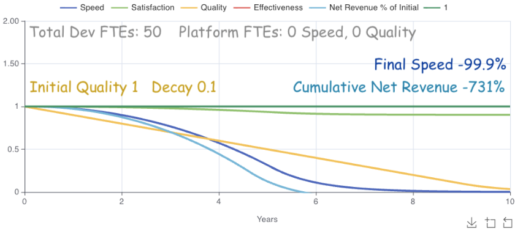
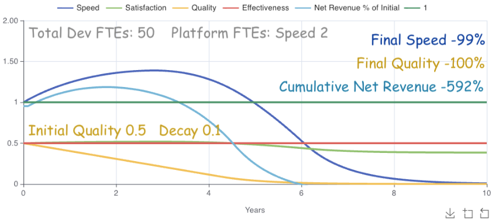
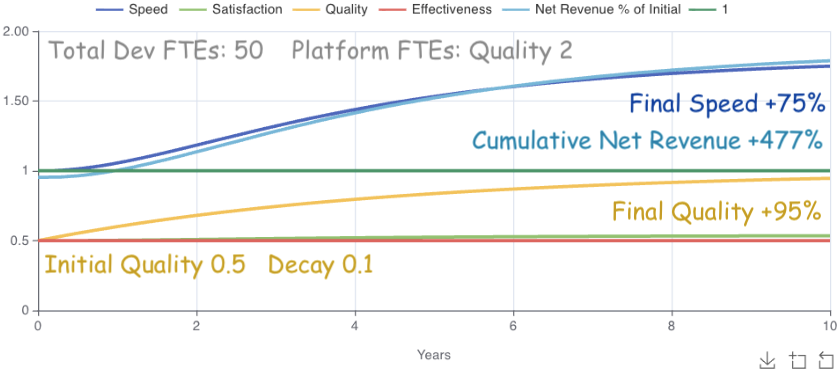
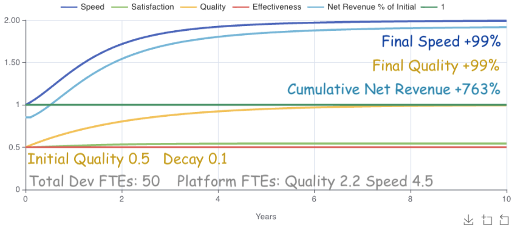
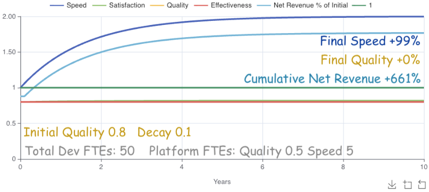
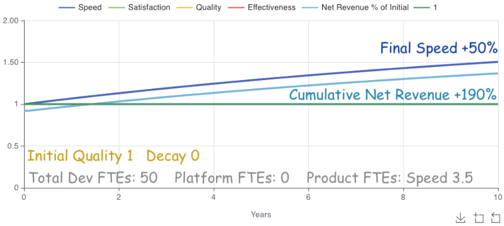
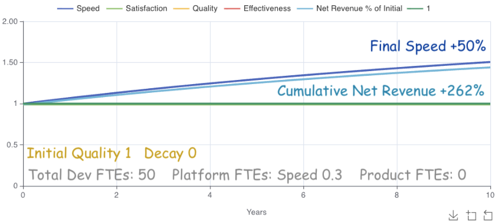

Allocating developers between Product and Platform teams is a challenging problem for many organizations. Optimizing one outcome (e.g., revenue, speed, quality, satisfaction) often affects others in unexpected ways. Dependencies may be cyclical like productivity <-> satisfaction, and transitive like quality -> productivity -> satisfaction. Predicting how Developer FTE allocation impacts each outcome is cognitively difficult, so we often use intuition as a shortcut and end up with sub-optimal allocations.

This article helps improve developer allocation decisions with an interactive "Stock and Flow" model that predicts Speed, Satisfaction, Effectiveness, Quality, and Revenue. It also provides example predictions, explains how the model works, and explains the research it's based on so you don't have to trust it blindly.

Like any model, it is wrong but useful.

<!-- omit from toc -->
## Table of Contents

- [Example Predictions](#example-predictions)
  - [How Will Features-only Prioritization Affect Engineering Outcomes?](#how-will-features-only-prioritization-affect-engineering-outcomes)
  - [How Should We Allocate Developers to Maximize Revenue?](#how-should-we-allocate-developers-to-maximize-revenue)
  - [How Can We Justify Platform / Infrastructure Work?](#how-can-we-justify-platform--infrastructure-work)
  - [Should Product Engineering Teams Develop Their Own Tools and Processes?](#should-product-engineering-teams-develop-their-own-tools-and-processes)
- [How the Model Gets from FTEs to Outcomes](#how-the-model-gets-from-ftes-to-outcomes)
- [How Each Outcome is Modeled](#how-each-outcome-is-modeled)
  - [Speed](#speed)
  - [Satisfaction](#satisfaction)
  - [Effectiveness](#effectiveness)
  - [Quality](#quality)
  - [Revenue](#revenue)
- [Assumptions, Omissions, and Oversimplifications](#assumptions-omissions-and-oversimplifications)
- [The](#the)
- [References](#references)


## Example Predictions

It is primarily designed to answer questions involving product and platform team allocations that improve each of those outcomes. Here are a few examples:

### How Will Features-only Prioritization Affect Engineering Outcomes?

Code quality naturally decays with additional code, differing opinions, new approaches, and other causes. When product teams focus on features to the exclusion of other outcomes, decay progresses unchecked. Here's how that looks.



The model's ability to handle multiple interacting variables quickly stands out. Decaying code quality (an aspect of technical debt) impacts speed at roughly `quality^1.5` based on CodeScene's research [2][codescene]. The initial speed impacts are barely noticeable. Over time it outpaces quality, slowing down new feature development. Revenue quickly follows due to cross-impacts from both `speed*.8` and `quality^0.2` based on my own estimates. Finally we see satisfaction drop at `speed * 0.097` based on Microsoft's Research [1][microsoft].

If speed dropping to 0 sounds odd to you, it does to me too. I dive deeper into that in "How Each Outcome is Modeled". Regardless, even a 50% drop in this case would result in over 300% lost revenue over 10 years.

The model's answer is that allocating FTEs only to feature development has clear negative impacts on engineering outcomes.

Let's ask it a more powerful question.

### How Should We Allocate Developers to Maximize Revenue?

Faced with quality decay's impacts, many companies scramble to increase speed (also calling it productivity, efficiency, and other variants). It's a good idea in theory.

<!-- omit from toc -->
#### What happens when we when we create a platform team and allocate 2 FTEs to improve speed?



The results are initially great. Speed increases nearly 40%. Eventually, however, the `quality^1.5` cross-impact eventually dominates speed's linear growth. Cumulative Net Revenue comes out 140% better than features-only, but still loses 590% net revenue over 10 years.

<!-- omit from toc -->
#### What happens if we allocate 2 FTEs to quality instead?



Massive difference! Allocating 2 FTEs to quality cost two FTEs to gain over 1000% Cumulative Net Revenue in 10 years, from -592% to +477%. Speed also ended at 75%, meaning our remaining 48 engineers now function as 84 engineers. Spending 2 engineers to gain 36 is a win.

Notice that the gains start to max out as quality approaches 100% though.

<!-- omit from toc -->
#### What happens if we let the model dynamically allocate FTEs to speed and quality?



Achieving 99% Quality and Speed with a 763% revenue gain over 10 years is a great result. I wasn't sure whether the model would allocate realistically given unlimited flexibility, but it allocated roughly 13% FTEs spread over 2.2 quality and 4.5 speed. 13% lies comfortably between a common platform allocation of ~10% and Google's ~16%, so the model's allocation seems reasonable.

Should 2.2 percent always be the optimal quality allocation?

Well... it depends.

<!-- omit from toc -->
#### What happens if the model optimizes revenue starting at 80% quality?



Starting at 80% quality, the model only allocates 0.5 FTEs to it. Just enough to stop decay.  Otherwise it focuses on speed. Why? The answer is interesting since it implies a threshold.

Below the threshold, quality has a large effect on other outcomes. Above the threshold, quality's remaining cross-impact potential is less effective than other outcome improvements at maximizing revenue. Since the current model only allocates FTEs statically at the beginning, we can't see exactly where the threshold occurs. We could illuminate it by allocating FTEs dynamically each cycle, though that's out of scope for the current model.

Still, we can learn a couple things it: 1. FTEs should always maintain quality enough to prevent decay. 2. FTEs should only prioritize quality up to a threshold (somewhere <= 80% in this case), then switch to other priorities with a greater effect on desired outcomes.

It would be super interesting to see how the model optimizes FTE allocations to maximize both revenue and satisfaction. Unfortunately Insightmaker doesn't support multi-outcome optimization yet.

### How Can We Justify Platform / Infrastructure Work?

For engineers struggling with this question, hopefully the last section will help. [Quantifying small efficiency improvements](../_posts/2025-06-18-how-quantify-engineering-efficiency-savings.md) is also a useful strategy.

For those struggling to create an initial platform team, this final question may help.

### Should Product Engineering Teams Develop Their Own Tools and Processes?

I have yet to meet a product team PM that relished allocating time to infrastructure work. Yet teams each working on their own infrastructure also create redundancy and inconsistency that slow down product development.

The model doesn't include those effects, but it does include adoption differences between product and platform teams. For example, you have 50 engineers and want to achieve a 50% speed increase. Here's how that looks with product teams working on their own tools.



Due to each team's small self-adoption scale (default around 5 engineers), total of 3.5 FTEs across product teams is necessary to achieve the 50% improvement. Cross-impacts result in 190% cumulative revenue over 10 years.  That sounds great until we look at the equivalent platform investment.



Platform teams' adoption scale for common processes and tools yields the same 50% speed increase and 70% greater cumulative net revenue (262%), with just 0.3 FTEs.

That's it for examples.  Check out the [the model](https://insightmaker.com/insight/3mOyx2fKEkQ6SKMyenE7or/Software-Engineering-Optimization-Model) for additional scenarios and to tweak team sizes, adoption rates, revenue contributors, and other variables.

The next section is for

## How the Model Gets from FTEs to Outcomes

This section is for those who want to understand the math behind the model.

Each outcome's is modeled as a linear equation with additional cross-impacts.
```
For all o in Outcomes: y_nextₒ = yₒ + slopeₒ + ∑ impactsₒ
```
`yₒ` is the current outcome's cartesian `y` value on the simulation.

`y_nextₒ` is the outcome's next `y` value since the model runs cyclically.

`slopeₒ` is the conversion of an outcome's allocated FTEs into its yearly improvement. It is based on Peter Seible's Enablement Effectiveness Model [3](#flowers), with adjustments for adoption rate and product vs platform team improvements. Speed's slope, for example, is modeled like:
```
slope = (
  product.speed_ftes
    * product.yearly_improvement_per_fte
    * product.improvement_adoption_rate
  + platform.speed_ftes
    * platform.yearly_improvement_per_fte
    * platform.improvement_adoption_rate
) * (remaining_product_engineers_working_on_user_features/total_engineers)
```

`∑ impactsₒ` represents other outcomes' impacts on outcome `o`. Those impacts occur in either a linear or power proportion based on the research behind them. The simplified equations are:
```
linear: `Δy impactₒ = (other_y₁ - other_y) * correlation`
power:  `Δy impactₒ = other_y₁^power/other_y₁ - 1`
```

## How Each Outcome is Modeled

### Speed
While the model itself is agnostic to speed's definition, the default \[Outcome]->Speed cross-impact values assume a meaning of Perceived Productivity as defined in Microsoft's Research [¹](#microsoft).

One quirk of the model here. In the examples the speed dropped to 0 as quality did. Given that the model's default meaning of speed is perceived productivity, and as humans we're unlikely to perceive ourselves as 0% productive, the model's speed dropping to 0% is an unlikely outcome. More likely it continuously slows as it approaches 0.

A speed of 1 represents product engineers' current speed. A speed of 2 is twice that, or 100% greater. A speed of 0 is a complete stop.

Representation: `[0, adjustable max]` decimal-formatted percent. Default max 2.\
Initial value: 1


### Satisfaction
While the model itself is agnostic to Satisfaction's definition, the default satisfaction cross-impact values assume a meaning of self-reported job satisfaction as defined in Microsoft's Research [¹](#microsoft). While other engineering stakeholders' satisfactions are important engineering outcomes (e.g. Customers, Executives, Product Managers, Platform Teams), this model currently excludes them for simplicity and/or lack of contributing factor research.

0 means product engineers' complete dissatisfaction. 1 means product engineers' complete satisfaction.

Representation: `[0, 1]` decimal-formatted percent\
Initial value: adjustable `(0,1]`. Default 0.8.

### Effectiveness
While the model itself is agnostic to Effectiveness definition, the default Effectiveness->Speed cross-impact value assumes it represents the average of self-reported "can complete tasks" (developer effectiveness) and "impactful work" (product effectiveness) from Microsoft's Research [¹](#microsoft).

0 means product engineers' complete ineffectiveness. 1 means product engineers' complete effectiveness.

Representation: `[0, 1]` decimal-formatted percent\
Initial value: adjustable `(0,1]`. Default 0.8.

### Quality
While the model itself is agnostic to quality definitions, the default Quality->Speed cross-impact value assumes quality as defined in CodeScene's research [²](#codescene) correlating their tool outcomes to business impact.

Though the model's default Quality->Speed cross-impact value assumes a meaning of code quality, not everyone will be using the CodeScene tool to measure it. Many definitions of quality will likely exhibit similar power curves. A general definition of quality that may be useful is tech debt's complement; 1 quality is 0% tech debt. 0 quality is 100% tech debt.

Representation: `[0, 1]` decimal-formatted percent\
Initial value: adjustable `(0,1]`. Default 0.8.


### Revenue
Revenue has various representations in the model. The core model value is gross revenue % change from initial. Other values are derived from that. The derived value visible in the simulation's Outcomes Tab is Net Revenue (revenue - cost) % of Initial.

Revenue has no slope, so it affects no other outcomes. It only changes as cross-impacts affect it. Those cross-impacts are my own estimates for convenience, and good candidates when your data differs.

Representation: `[0, n]` decimal-formatted percent\
Initial model value (Gross Revenue % Change): 1\
Initial value in simulation (Net Revenue % Change): 1, though can be less depending on FTE allocation


## Assumptions, Omissions, and Oversimplifications

- Most things are oversimplified in an effort to keep the model simple. A more robust model based on e.g., [DX's DXI indicator](https://getdx.com/research/the-one-number-you-need-to-increase-roi-per-engineer/) would be more accurate, but I don't have regression coefficients for its slopes and cross-impacts. And the model is useful enough as-is.

- Many cross-impacts aren't represented in the model for either simplicity or lack of research. For example, satisfaction intuitively impacts quality (think motivation to produce quality work when tired or frustrated), but I found no research to that effect.

- Each cross-impact takes one simulation cycle to apply. For example, direct dependencies like Quality->Speed take 1 cycle before speed changes, and transitive dependencies like Quality -> Speed -> Satisfaction take 2 cycles before satisfaction changes. Cycles currently run every 0.1 years. Other than the one-cycle cross-impact delay, no other delays are implemented in the model.

- Max-capped outcomes (all except revenue) increase more slowly as they approach their max, reflecting the reality that results become harder to achieve as low-hanging fruit disappears. e.g., achieving 99% uptime is much easier than achieving 99.9999% uptime.  Slowing changes that approach 0 would also make sense for some outcomes (e.g. speed), but defining the cases and math to support them is non-trivial, so leaving it out for now.

- The model makes a number of assumptions for convenience. For example, Team sizes default to 7 members with 1 PM, 1 Designer, and 5 Developers. Costs for each type of headcount have default values, and Initial Yearly Revenue defaults to total yearly cost * 10.

## The

## References

- <a id="microsoft">1.</a> Towards a Theory of Software Developer Job Satisfaction and Perceived Productivity (https://www.microsoft.com/en-us/research/wp-content/uploads/2019/12/storey-tse-2019.pdf)

- <a id="codescene">2.</a> Code Red: The Business Impact of Code Quality (https://arxiv.org/pdf/2203.04374)

- <a id="flowers">3.</a> Peter Seible's Enablement Effectiveness Model (https://gigamonkeys.com/flowers/)

